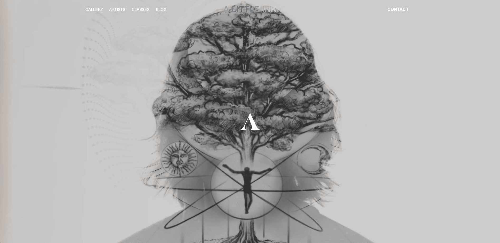

# 🚀 A Little Ink | David T Tattooist

> **Modern Tattoo Studio Website**  
> A professional tattoo studio website built with cutting-edge technologies, featuring artist portfolios, gallery showcase, blog, and booking system.

---

## 📋 About

**A Little Ink** is a modern, high-performance website for **David T Tattooist** - a premier tattoo studio located in District 1, Ho Chi Minh City. This project showcases the latest web technologies to deliver an exceptional user experience with smooth animations, responsive design, and seamless content management.

### Key Features

- 🏠 **Dynamic Homepage** - Hero video/animation, featured gallery, artist showcase
- 👨‍🎨 **Artist Profiles** - Detailed artist portfolios with achievements and work samples
- 🖼️ **Gallery** - Comprehensive tattoo gallery with filtering and zoom functionality
- 📝 **Blog** - Content management for articles, tips, and studio updates
- 🎓 **Training Courses** - Professional tattoo training course information
- 📅 **Booking System** - Integrated booking form with email notifications
- 📱 **Fully Responsive** 
- ⚡ **High Performance** 
- 🎭 **Smooth Animations** 

---

## Highlights

- **Modern Architecture** - Built with Next.js 14 App Router and React Server Components
- **Headless CMS** - Content managed through HyGraph (GraphQL) for flexibility and scalability
- **Performance Optimized** - Server-side rendering, image optimization, and code splitting
- **Beautiful UI/UX** - Modern design with smooth animations and responsive layouts
- **SEO Friendly** - Optimized meta tags, sitemap, and structured data
- **Type Safe** - Full TypeScript implementation for better code quality

---

## 🌐 Live Demo

🔗 **Visit**: [https://david-t-tattooist.vercel.app/](https://david-t-tattooist.vercel.app/)

---

**Made with ❤️ using modern web technologies**

⭐ Star this repo if you find it helpful!

